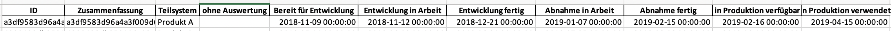
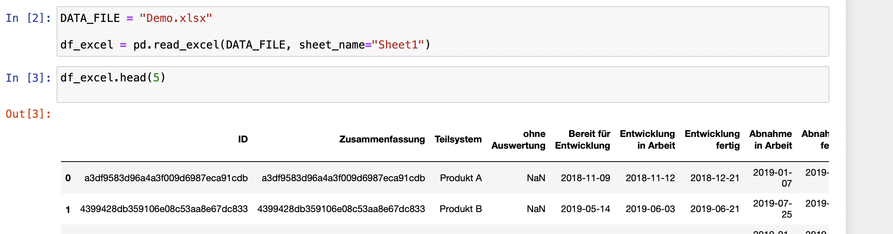
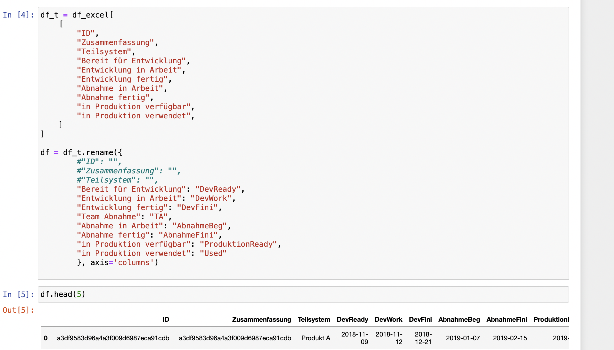
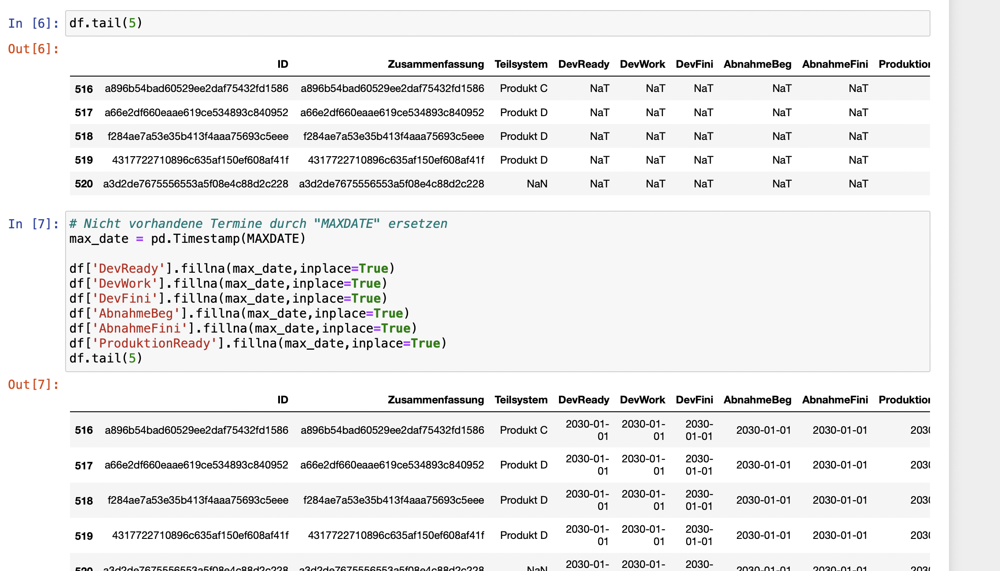

# Datenanalysen mit Pandas und Co

Ich habe in den Weihnachtstagen ein wenig Zeit mit den Datenanalyse Werkzeugen Python, Pandas und co verbracht ;-).

In dieser kleinen Artikel Serie möchte ich euch zeigen, wie damit recht einfach Datenanalysen erstellt werden können. ALs Beispiel dienen mir Daten aus unserem Entwicklungsprozess, ...

Im ersten Teil geht es um das Einlesen und Vorbereiten der Daten. Im zweiten Teil folgen dann grafische Auswertungen zu typischen agilen Metriken (_Cumulative Flow Diagram_ und _Lead Time_).

Als Entwicklungsumgebung kommen Jupyter-Notebooks zum Einsatz. Damit kann Python Code interaktiv ausgeführt werden und die Ergebnisse direkt angezeigt werden. (Verweis auf c´t Artikel )

Der Quellcode für die Jupyter-Notebooks und Python-Module sowie die Beispieldaten finden sich in einem [Github-Repository](https://github.com/rzablo/effective-doodle.git).

## Schritt 1: Daten aus Excel-Datei einlesen

Als Beispieldaten verwende ich eine Excel-Datei mit folgender Struktur:



Die Spalten ID und Zusammenfassung für das Beispiel berechnete Hashwerte. Die Datumsspalten geben die Termine an zu denen die Arbeitspakete jeweils in diesen Zustand eingetreten sind.

Die zentrale Datenstruktur in Pandas ist ein DataFrame, eine Tabellenartigestruktur mit der sehr elegante Operationen möglich sind.

Das Einlesen einer Excel-Datei ist sehr einfach.

```python
DATA_FILE = "Demo.xlsx"

df_excel = pd.read_excel(DATA_FILE, sheet_name="Sheet1")
```



Beim Einlesen versucht Pandas die Datentypen zu erraten. Meistens funktioniert das erstaunlich gut. Bei diesen Beispieldaten erkennt Pandas die Datumswerte und setzt für diese Spalten den Datentyp automatisch richtig.

Machmal muss man etwas nachhelfen. Dabei leistet die Funktion `pd.to_datetime()` wertvolle Dienste. Das könnte dann so aussehen:

```python
wwf["Date"] = pd.to_datetime(wwf["Date"], format="%d.%m.%y")
```

In unserem Beispiel nehme ich im ersten Schritt zwei Anpassungen an der Struktur der Daten vor.

1. Nicht alle Spalten in der Excel-Datei sind für die Auswertung relevant, daher wähle ich nur die notwendigen Spalten aus. Die Selektion erfolgt über den Spaltennamen `df['Spaltenname']`.
2. Zur Vereinfachung der Schreibweise im Code benenne ich die Spalten anschließend um. Die Funktion `rename()` erwartet als Parameter ein Dictionary mit Wertepaaren aus alter Name und neuer Name.



## Schritt 2: Dateninhalte bereinigen

In unseren Beispieldaten enthalten nicht alle Datensätze vollständige Daten. So sind beispielsweise einige Datumsfelder noch leer, da die zugehörigen Aufgaben noch in Berarbeitung sind. Pandas verwendet für fehlende Werte eine Implementierung aus dem Framework Numpy: `np.NaN` bzw. `np.NaT` speziell für Datums- und Zeittypen.

Da wir mit den Datumswerten Berechnungen durchführen wollen, ersetze ich alle nicht vorhandenen Datumswerte durch ein weit in der Zukunft liegenden Wert.



* * * *

### Ein paar Tricks

Das Dictionary für die `rename`-Funktion kann initial wie erzeugt werden:

```python
a = df_t.columns
d = dict(zip(a,a))
d
```

Die Ausgabe dieser Zeilen kann dann in eine Code-Zelle übernommen und so wie erforderlich angepasst werden.
