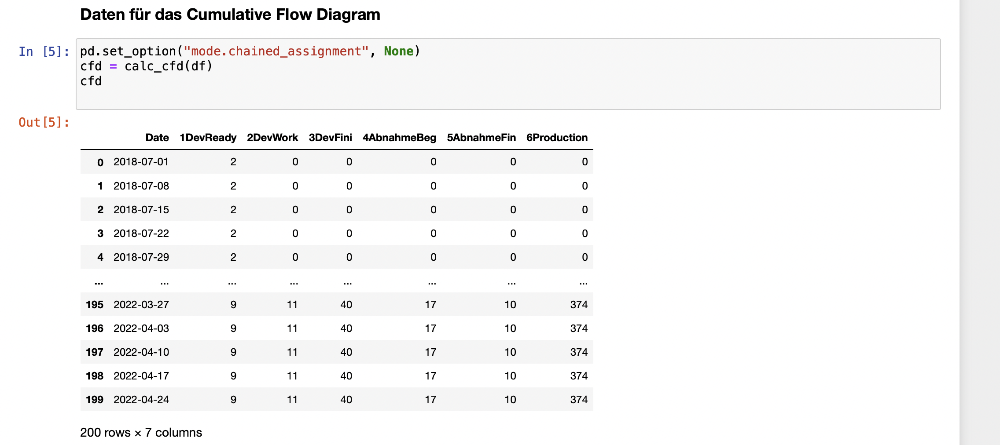
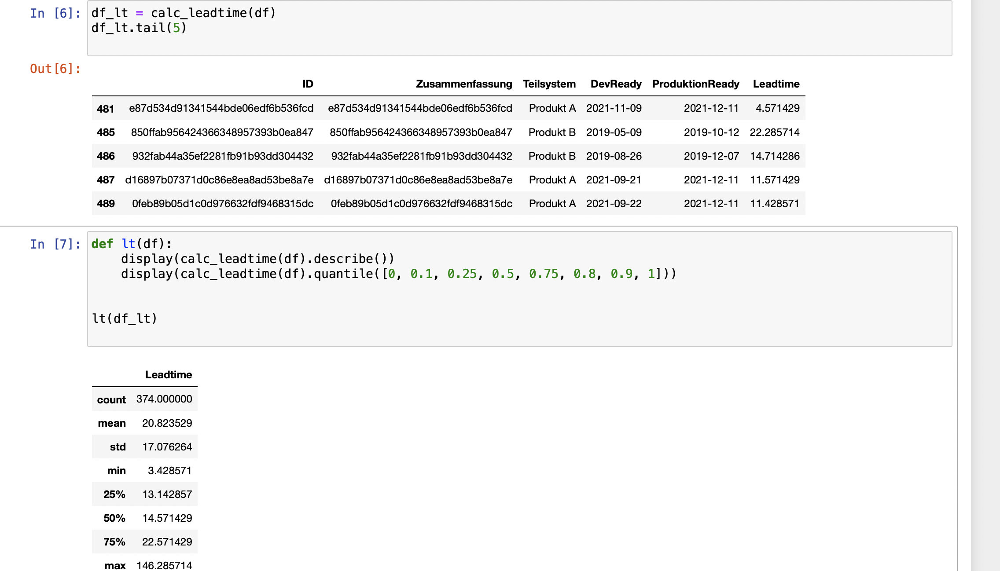

# Python: Datenanalysen mit Pandas und Co


In dieser kleinen Artikelserie möchte ich euch zeigen, wie mit der Python-Bibliothek Pandas recht einfach Datenanalysen erstellt werden können. Im Rahmen eines kleinen Hobby-Projektes habe ich mich mit den Bibliotheken Pandas und Altair beschäftigt. Die dabei erlangten Kenntnisse habe ich in den letzten Wochen immer mal wieder auf Daten im Unternehmen angewendet. Als Beispiel dienen mir Daten aus unserem Entwicklungsprozess, die ich anonymisiert und verändert als Datensatz zur Verfügung stelle.

Im ersten Teil geht es um das Einlesen und Vorbereiten der Rohdaten, dem Data Wrangling. Im zweiten Teil folgen dann grafische Auswertungen zu typischen agilen Metriken (_Cumulative Flow Diagram_ und _Lead Time_).

Als Entwicklungsumgebung kommen Jupyter-Notebooks zum Einsatz. Damit kann Python Code interaktiv ausgeführt werden und die Ergebnisse direkt angezeigt werden. Die Zeitschrift c´t hat in [Heft 5/2022](https://www.heise.de/select/ct/2022/5/2135510023934602155) mehrere Artikel zu Python veröffentlicht, die einen guten Einstieg ermöglichen. In der Zeitschrift [iX 3/2022](https://www.heise.de/select/ix/2022/3/2129209064878376414) gibt Wadim Wormsbacher einen Überblick zum Verarbeitung von Daten (_Data Wrangling_) mittels Pandas.

Der Quellcode für die Jupyter-Notebooks und Python-Module sowie die Beispieldaten finden sich in einem [Github-Repository](https://github.com/rzablo/effective-doodle.git).

## Schritt 1: Daten aus Excel-Datei einlesen

Als Beispieldaten verwende ich eine Excel-Datei mit folgender Struktur:


Die Spalten ID und Zusammenfassung für das Beispiel berechnete Hashwerte. Die Datumsspalten geben die Termine an zu denen die Arbeitspakete jeweils in diesen Zustand eingetreten sind.

Die zentrale Datenstruktur in Pandas ist ein DataFrame, eine Tabellenartigestruktur mit der sehr elegante Operationen möglich sind.

Ich bin immer noch begeistert davon, wie einfach das Einlesen von Daten aus einer Excel-Datei funktioniert. Gerade Daten in Excel-Formaten begegnen mir im beruflichen Kontext sehr häufig. Daher war es mir bei meinen Arbeiten mit Pandas sehr wichtig, die Excel-Dateien möglichst unverändert verarbeiten zu können. 


Beim Einlesen versucht Pandas die Datentypen zu erraten. Meistens funktioniert das erstaunlich gut. Bei unseren Beispieldaten erkennt Pandas die Datumswerte und setzt für diese Spalten den Datentyp automatisch richtig. Am Ende dieses Artikels zeige ich im Abschnitt "Tips und Tricks" wie man nachhelfen kann, wenn das automatische Erkennen nicht richtig funktioniert.

In unserem Beispiel nehme ich im ersten Schritt zwei Anpassungen an der Struktur der Daten vor.

1. Nicht alle Spalten in der Excel-Datei sind für die Auswertung relevant, daher wähle ich nur die notwendigen Spalten aus. Die Selektion erfolgt über den Spaltennamen `df['Spaltenname']`.
2. Zur Vereinfachung der Schreibweise im Code benenne ich die Spalten anschließend um. Die Funktion `rename()` erwartet als Parameter ein Dictionary mit Wertepaaren aus alter Name und neuer Name.


## Schritt 2: Dateninhalte bereinigen

In unseren Beispieldaten enthalten nicht alle Datensätze vollständige Daten. So sind beispielsweise einige Datumsfelder noch leer, da die zugehörigen Aufgaben noch in Bearbeitung sind. Pandas verwendet für fehlende Werte eine Implementierung aus dem Framework Numpy: `np.NaN` bzw. `np.NaT` speziell für Datums- und Zeittypen.

Da wir mit den Datumswerten Berechnungen durchführen wollen, ersetze ich alle nicht vorhandenen Datumswerte durch einen weit in der Zukunft liegenden Wert.


## Schritt 3: Berechnung der Metriken

In meiner Artikelserie betrachte ich zwei typische Metriken in agilen Entwicklungsprojekten. Dies ist zum einen das Cumulative Flow Diagram und zum anderen die [Lead Time bzw. Cycle Time](https://www.digite.com/agile/lead-time-cycle-time/).

Für die Berechnung dieser Metriken habe ich jeweils eine Python Funktion geschrieben, die als Input-Parameter das hier vorbereitete DataFrame verwendet.

Das CFD möchte ich auf Wochenbasis erstellen. Daher zähle ich jeweils wochenweise wieviele Arbeitspakete im jeweiligen Status enthalten sind.

```python
   for ind in ddf.index:
        theDate = pd.to_datetime(ddf["Date"][ind])
   
        ddf["1DevReady"][ind] = df.loc[
            (df["DevReady"] <= theDate) & (df["DevWork"] > theDate)
        ].ID.count()
```



Die Lead Time berechne ich als Zeitraum zwischen dem Zeitpunkt zu dem das Arbeitspaket  bereit für die Entwicklung ist und dem Zeitpunkt zu dem das Arbeitspaket in Produktion gegangen ist.

```python
    dfx["Leadtime"] = (dfx["ProduktionReady"] - dfx["DevReady"]).dt.days / 7
```


Pandas bringt eine ganze Reihe von Statistik-Funktionen mit, die sich sehr einfach auf ein DataFrame anwenden lassen. Zur Veranschaulichung berechne ich mittels der _describe_-Funktion ein paar Standardwerte. Der Mittelwert spiegelt dabei unseren Entwicklungsprozess sehr gut wieder.

## Ausblick auf Teil 2

Ich habe in diesem Artikel gezeigt, wie vorhandene Daten aus Excel-Dateien mit der Python-Bibliothek Pandas eingelesen und verarbeitet werden können. Zu einer Veranschaulichung gehören jedoch vor allem aussagekräftige Diagramme. Im nächsten Teil zeige ich das Erstellen von Grafiken aus diesen Daten mittels des Python Frameworks [Altair](https://altair-viz.github.io).

* * * *

### Ein paar Tips und Tricks

#### Datumswerte richtig parsen

Machmal muss man bei den Datumswerten etwas nachhelfen, damit Pandas diese richtig parsen kann. Eine mögliche Fehlerquelle ist die `locale`-Einstellung, die verwendet wird. Ein Datum in der Form 08.03.2022 wird dann gerne mal als 3. August interpretiert. Für die korrekte Interpretation von Datumswerten leistet die Funktion `pd.to_datetime()` wertvolle Dienste. Das könnte dann so aussehen:

```python
df["Date"] = pd.to_datetime(df["Date"], format="%d.%m.%y")
```

Die Format Codes sind in der [Dokumentation](https://docs.python.org/3/library/datetime.html#strftime-and-strptime-behavior) der Python Standard Bibliothek beschrieben.

#### Dictionary für rename vorbelegen

Das Dictionary für die `rename`-Funktion kann initial wie folgt erzeugt werden:

```python
	a = df_t.columns
	d = dict(zip(a,a))
	d
```

Die Ausgabe dieser Zeilen kann dann in eine Code-Zelle übernommen und so wie erforderlich angepasst werden.

#### Spaltenselektion berechnen

Nicht immer ist es mit der einfachen Selektion von ein paar Spalten getan. Bei komplexeren Rohdaten-Tabellen kann die Selektion der gewünschten Tabellen durchaus aufwändiger sein. Da ich andererseits tippfaul bin, habe ich einem Anwendungsfall folgende Lösung gefunden:

```python
(1)	cols = pd.Series(df_excel.columns.to_list())
(2)	icols = cols[cols.str.contains("gesamt")].index
(3)	df_t = df_excel.iloc[:-1, np.r_[0:9, icols]]
```

In Zeile 1 ermittle ich alle Spaltennamen als Liste. Daraus suche ich in Zeile 2 alle Spaltennamen, die den String "gesamt" enthalten. In Zeile 3 baue ich dann einen neuen DataFrame, der mit Ausnahme der letzen alle Zeilen (`:-1`) enthält und dann die ersten 10 Spalten (`0:9`) sowie alle in (2) gefundenen Spalten enthält. `np.r_` erzeugt dabei ein Array von einzelnen Indexwerten.
